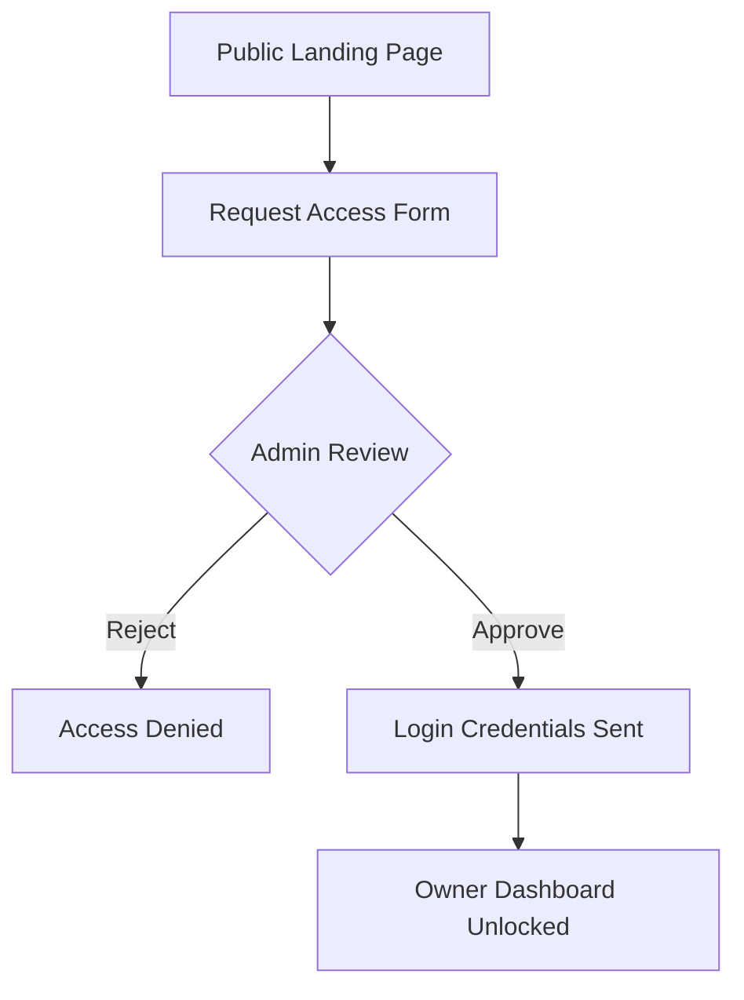
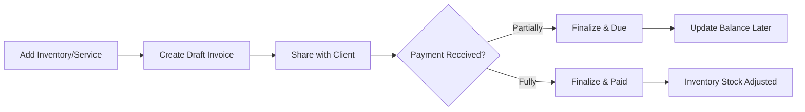

# 📄 SFP Billing Solutions - Documentation

Welcome to the official documentation for **SFP Billing Solutions**, a high-performance, premium billing and inventory management system designed for modern businesses.

---

## 🔝 Overview
SFP Billing Solutions is a comprehensive ERP-lite application built to streamline the billing process for both product-based and service-based businesses. It features a robust multi-role architecture, real-time analytics, and automated inventory tracking.

---

## 👥 User Roles & Permissions

The system operates on a dual-role hierarchy:

### 🛠️ Administrator (Admin)
The internal system controller.
- **Access Management**: Review and onboard new business owners via the "Access Requests" portal.
- **Global Overview**: Monitor total platform revenue, active business partners, and system-wide growth.
- **Merchant Management**: Track the performance of all registered businesses.
- **Broadcast System**: Send real-time announcements to all live dashboards.

### 🏢 Business Owner (Owner)
The primary user of the billing engine.
- **Inventory Control**: Manage product stocks, service categories, and low-stock thresholds.
- **Billing Engine**: Generate professional Product and Service invoices with automated GST calculations.
- **Payment Tracking**: Monitor outstanding balances and finalize draft quotations.
- **Business Branding**: Customize business logos and profile details.

---

## 🧩 Core Application Modules

### 1. 📊 Smart Dashboard
The heart of the application.
- **Visual Analytics**: Interactive charts (Chart.js) showing revenue growth and category distribution.
- **KPI Tracking**: Real-time sales targets, outstanding payments, and low-stock alerts.
- **Admin HUD**: Global metrics including "Global Revenue" and "Success Rate" for new registrations.

### 2. 📦 Inventory & Stock Management
- **Category System**: Organize items into groups for better reporting.
- **Product vs Service**: Dedicated logic for physical goods (stock-tracked) and professional services (unit-based).
- **Auto-Deduction**: Inventory levels automatically decrease upon finalized product sales.

### 3. 🧾 Advanced Billing Engine
- **Product Invoices**: Support for HSN codes, GST tiers, and quantity-based pricing.
- **Service Invoices**: Flexible billing for hourly work, milestones, or expert consulting.
- **Draft & Finalize**: Save works-in-progress and finalize them only when the deal is sealed.

### 4. 🚚 E-Way Bill Integration
- Generate compliant transport documents for moving goods across state lines.
- Dedicated log system to track movement history.

---

## 🔄 How It Works? (Workflow)

### **The Onboarding Flow**


### **The Billing Cycle**


---

## 🖥️ Application Screenshots (Suggested)

To make this documentation look professional, I recommend adding screenshots of the following sections. You can replace these descriptions with actual image files:

1.  **Owner Dashboard**: *Capture the interactive charts and top-performing items widgets.*
2.  **Product Bill Generation**: *Show the dynamic item adding flow and GST calculations.*
3.  **Manage Stocks**: *Display the inventory list with low-stock badges.*
4.  **Admin HUD**: *Show the global revenue and active merchant metrics.*

---

## 🛠️ Technical Stack
- **Backend**: Java 17+, Spring Boot 3.x
- **Frontend**: Thymeleaf, Vanilla JS, HTML5, CSS3 (Glassmorphism design)
- **Database**: H2 (Development) / MySQL (Production)
- **Charts**: Chart.js
- **Icons**: FontAwesome 6

---

## 🚀 Setup & Installation

1. **Clone the Project**:
   ```bash
   git clone https://github.com/Deepansh1822/Bill-Generating-Software.git
   ```
2. **Build the Application**:
   ```bash
   mvn clean install
   ```
3. **Run the Application**:
   ```bash
   mvn spring-boot:run
   ```
4. **Access the Web Interface**:
   Go to `http://localhost:8080/billing-app/` in your browser.

---

## 📝 Best Practices for Usage
- **Regular Updates**: Ensure inventory is accurate before creating a large batch of invoices.
- **Logo Quality**: Use a high-resolution PNG for your "Business Branding" to ensure professional PDF exports.
- **Admin Vigilance**: Review pending requests regularly to ensure smooth onboarding of new partners.

---
*Created by Antigravity for SFP Billing Solutions.*
